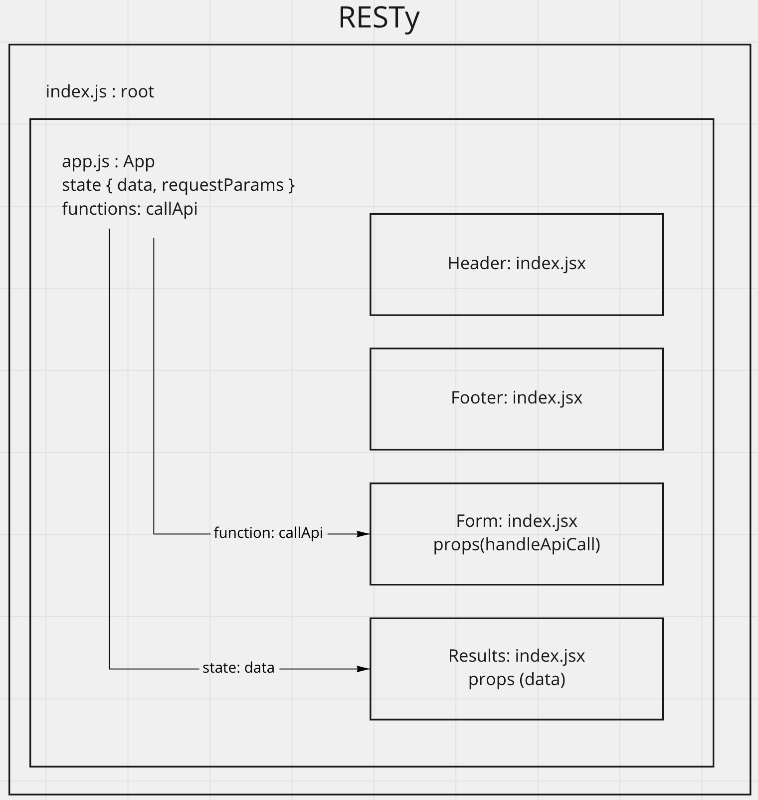

# RESTy

## About The Project
CodeFellows Lab Assignment to build...

API testing tool application that can be run in any browser, allowing a user to easily interact with APIs in a familiar interface.

## Built With
 - React.js
 - Sass

## Getting Started

This folder only contains the components required for your React Application.

1. Run `npx create-react-app resty --use-npm` to create your react application.
1. `cd resty` and replace the `src` folder generated by CRA with the `src` folder in this starter-code folder.
1. Run `npm start` to visually validate that your starter-code components are working properly.

## Usage

Will outline useful examples here.

## UML

## Roadmap

- [x] Convert class Components to function based Components (Header, Form, Results, Footer)
- [x] Sass style sheet for each Component (Header, Form, Results, Footer)

## License
Distributed under the MIT License. See LICENSE.txt for more information.

## Contact
Erik Savage

Project Link: https://github.com/eriksavage/resty

## Acknowledgements

- Code Fellows Code 401: Advanced Software Development in Full-Stack JavaScript Course
- othneildrew's [Best-README-Template](https://github.com/othneildrew/Best-README-Template)
- [React Docs](https://reactjs.org/docs/getting-started.html)
- [Sass Documentation](https://sass-lang.com/documentation)